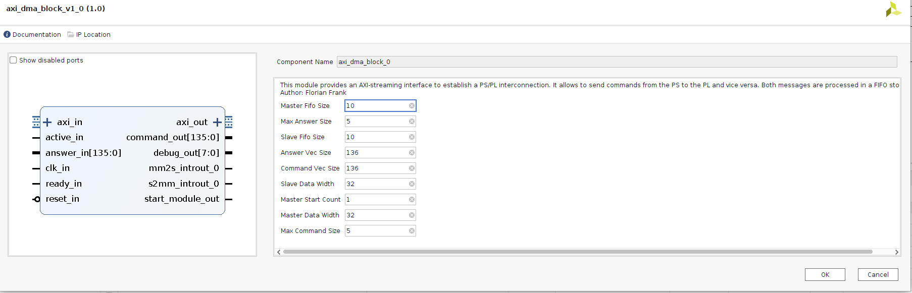
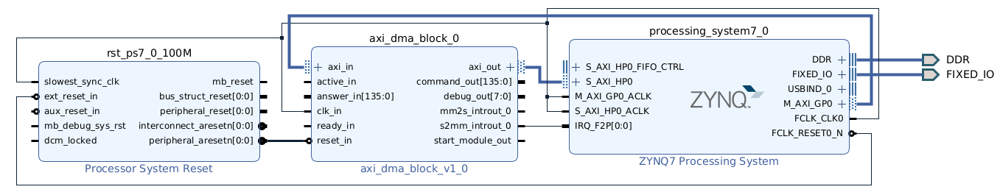
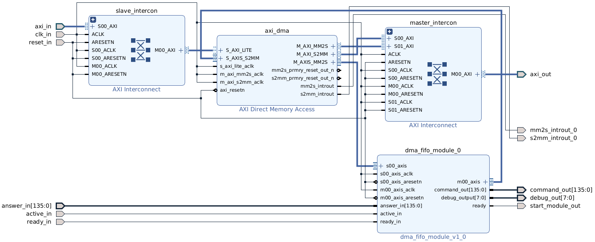

# AXI-streaming-interface

This repository provides an implementation of an AXI-streaming interface that enables communication between the Processing System (PS) and the Programming Logic (PL) of various Xilinx FPGAs. It uses Direct Memory Access (DMA) mapped into the DRAM establish a data transmission between the PS and PL.

The module is packed as an IP core like shown in the subsequent section.

There exitsts two FIFO memories. One holds data transmitted over an AXI-slave interface from the PS, while the other stores data from the PL to be sent by an AXI-master interface to the PS. Parallel reading and writing are both possible.

### IP-Core integration

The IP core can be integrated into an existing block design like shown in the figure below:

It provides the following interface:

### Input Wires

|Signal  | Purpose|
|--------|--------|
| **axi_in**| 32-bit AXI intput bus to send data from the PS to the PL. Internally it uses an AXI-interconnect with an AXI light protocol to control the FIFO implementation.|
|**active_in**| Input signal indicating that a module connected to the axi_dma_block is currently processing data stored in the AXI-FIFO. The axi_block module waits for the signal to become inactive before removing an entry from the DMA.|
|**clk_in**| Input clock signal controlling the execution frequency of the master and slave module as well as the FIFOs.|
|**ready_in**| Input ready signal must be high for only one clock cycle indicating that data on the answer_in port can be read, stored in the FIFO and transmitted to the PS. |
|**ready_in**| Input ready signal must be high for only one clock cycle indicating that data on the answer_in port can be read, stored in the FIFO and transmitted to the PS. |
|**reset_in**| Clears all FIFOs and resets the state machines to return to IDLE mode. |

 

### Output Wires

|Signal  | Purpose|
|--------|--------|
| **axi_out**|Output 32-bit AXI-bus to send data in the FIFO received by the answer_in interface to the PS. |
|**command_out**| Sends data from the slave FIFO to a connected module in the PL. |
|**debug_out**| Output debug port. Sending the data in 8-bit blocks to send them for test purposes, e.g. over an UART interface.|
|**mm2s_introut_0**| Interrupt, triggered when data is avaible.|
|**s2mm_introut_0**| Interrupt, triggered when data is sent. |
|**start_module_out**| Indicating for one clock cycle that the command_out-port can be read and the data processing can be started. |

### Internal Structure

